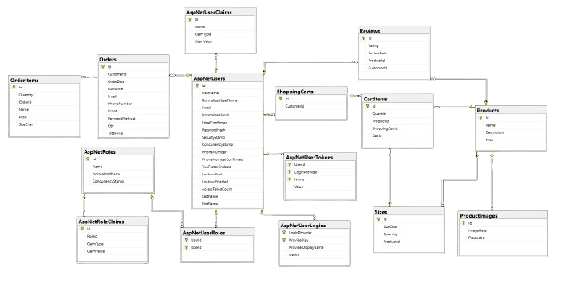

# Voam Clothing

  

## Introduction 

Welcome to the official website of Voam, a distinguished clothing brand based in Bulgaria. Here, you can explore and purchase the complete range of Voam's offerings, from our latest collections to timeless classics. Voam is dedicated to providing fashion-forward, quality apparel accessible through a seamless and user-friendly online platform.

This site is built with a keen focus on clean, efficient code, ensuring a smooth and responsive user experience. Whether you're here to shop or to delve into the technical aspects of our site, Voam offers a comprehensive and engaging online presence for all visitors.

## Features

Voam's website offers a range of features designed to enhance your shopping experience and manage our platform effectively:

- Comprehensive Product Catalog: Browse through an extensive collection of apparel, including detailed information about each item such as fabric type, sizes available, and more.
- Advanced Filtering and Sorting: Easily find the clothing you love with options to filter by price and name, as well as sorting capabilities that allow you to view products according to popularity, and more.
- Order History: Access your past purchases and track the status of your current orders, ensuring you are up-to-date with all your transactions.
- Responsive Design: Enjoy a seamless shopping experience on any device, thanks to our mobile-friendly and responsive website design.
- Easy Management from Our Administrative Panel: For administrators, manage products, orders, and user data efficiently with our intuitive admin panel.

## Technical Specifications

### Used Technologies

- .NET Core 8.0
- ASP.NET Core
- Entity Framework Core
- MS SQL Server -> Development environment database
- React
- HTML, CSS, Bootstrap
- Formik, Yup
- Chart.js, React-icons, SweetAlert2
- JavaScript
- NUnit
- Moq

### Database Diagram

  

## License

This project is licensed under the MIT License - see the [LICENSE](https://opensource.org/license/mit/) file for details.

---

Thank you for using Voam site!  
We hope you enjoy exploring our diverse collection and experiencing the unique world of Voam fashion.
